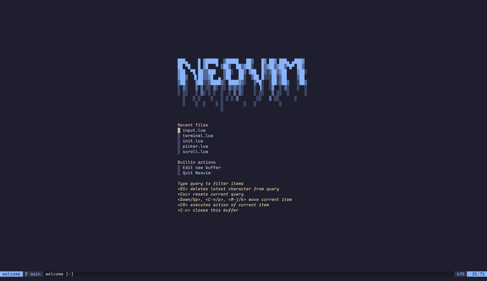

# Welcome to my Neovim Configuration
## How it looks

## What's included
I like to keep my config minimal, so I don't have a lot of things here. However, I have the essentials that I think are important for my workflow. Feel free to build upon this as much as you want to. These are the things that I regularly use and are included in my config:
1. LSP Stuff (duh)
2. Catppuccin themes (I like one dark more, but this is more available everywhere)
3. Treesitter (again, duh)
4. Harpoon (of course)
5. Undo Tree
6. Git stuff (using Neogit and gitsigns)
7. Plugins for HTML, svelte, JS/TS and prettier
8. TODO Comments (Feel free to remove this. I use it to procrastinate mostly)
9. Auto pairs, Auto close tags and Surrounds
10. Context dimmer
11. Integrated Terminal
12. Notifications
13. File explorer (I mainly use yazi, but if needed, there's a file tree as well, which is disabled for now)
14. Fuzzy finders
15. Zen mode (mostly useless. I kept it as it looks cool. May remove it in future)
16. Status line
17. Commenting stuff
18. Color preview
19. Highlight words
20. Go to Preview
21. Diagnostics viewer
22. Markdown Preview
23. AI Coding assistant (this is a free one, so it's mostly useless. I don't use it much, but like to keep it around).
## Default keybindings

| Action                                                             | Mode           | Keybind    |
| ------------------------------------------------------------------ | -------------- | ---------- |
| Shift Block Down                                                   | Visual         | J          |
| Shift Block Up                                                     | Visual         | K          |
| Go to normal mode                                                  | Insert         | jj         |
| Yank till end of line (except the EOL character)                | Normal         | Y          |
| Join lines while keepiong cursor on current line                | Normal         | J          |
| Scroll down while keeping cursor at middle                      | Normal         | CTRL + D   |
| Scroll up while keeping cursor at middle                        | Normal         | CTRL + U   |
| Go to next search while keeping cursor at middle                | Normal         | n          |
| Go to previous search while keeping cursor at middle            | Normal         | N          |
| Paste without yank                                                 | Visual block   | SPACE + P  |
| Yank to clipboard                                                  | Normal, Visual | SPACE + Y  |
| Delete to clipboard                                                | Normal, Visual | SPACE + D  |
| Format document with LSP                                           | Normal         | SPACE + F  |
| Convert current file to executable (only on unix based systems) | Normal         | SPACE + x  |
| Go up in diagnostics                                               | Normal         | CTRL + K   |
| Go down in diagnostics                                             | Normal         | CTRL + J   |
| Delete current buffer                                              | Normal         | SPACE + bx |
| Go to next buffer                                                  | Normal         | SPACE + bb |
| Go to previous buffer                                              | Normal         | SPACE + bB |
| Show file outline                                                  | Normal         | SPACE + 0  |
| Rename variable                                                    | Normal         | F2         |
| Go to reference                                                    | Normal         | gr         |
| Show code actiona                                                  | Normal         | L          |
| Show outgoing function calls                                       | Normal         | SPACE + h  |
| Show incoming function calls                                       | Normal         | SPACE + H  |
| Open git dashboard                                                 | Normal         | SPACE + gs |
| Git commit                                                         | Normal         | SPACE + gc |
| Git pull                                                           | Normal         | SPACE + gp |
| Git push                                                           | Normal         | SPACE + gP |
| Git stage hunk                                                     | Normal         | SPACE + ha |
| Git blame                                                          | Normal         | SPACE + lb |
| Git diff                                                           | Normal         | SPACE + hd |
| Open Yazi                                                          | Normal         | SPACE + pv |
| Open yazi in current working directory                          | Normal         | SPACE + cw |
| Open undo tree                                                     | Normal         | SPACE + u  |
| Open Disagnostics                                                  | Normal         | SPACE + tt |
| Open Workspace Disagnostics                                        | Normal         | SPACE + tw |
| Open Document Disagnostics                                         | Normal         | SPACE + td |
| Open Disagnostics in quicklist                                     | Normal         | SPACE + tq |
| Open TODO Comments in Fuzzy Finder                                 | Normal         | SPACE + st |
| Open TODO, FIX and FIXME Comments in Fuzzy Finder               | Normal         | SPACE + sT |
| Add file to Harpoon                                                | Normal         | SPACE + a  |
| Show Harpoon quick menu                                            | Normal         | CTRL + e   |
| Go to previous and next buffers                                    | Normal         | CTRL + p   |
| Fuzzy find files                                                   | Normal         | SPACE + pf |
| Fuzzy find git files                                               | Normal         | SPACE + pp |
| Fuzzy find buffers                                                 | Normal         | SPACE + bl |
| Fuzzy find search term from files                                  | Normal         | SPACE + ps |
| Go to Zen mode                                                     | Normal         | SPACE + z  |
| Go to Zoom mode                                                    | Normal         | SPACE + Z  |
| Open Integrated Terminal                                           | Normal         | SPACE + `  |
| Show notification History                                          | Normal         | SPACE + n  |
| Dismiss all notifications                                          | Normal         | SPACE + nn |
| Toggle line wrap                                                   | Normal         | SPACE + uw |
| Toggle file diagnostics                                            | Normal         | SPACE + ud |
| Toggle light/dark mode                                             | Normal         | SPACE + ub |
| Toggle indentation markers                                         | Normal         | SPACE + ug |
| Toggle Dim                                                         | Normal         | SPACE + uD |
## How to use the file explorer
The file explorer I use in neovim is my terminal file explorer, yazi. So this won't work if yazi is not installed on your system. Please follow [this](https://yazi-rs.github.io/docs/installation/) to install yazi. Once installed, it should work out of the box.
## How to enable the file tree
The file tree is already enabled. All you have to do is turn on the keybind to use it. So go to [lua/config/snacks/init.lua](lua/config/snacks/init.lua) and uncomment line 41. Now, restarting neovim should add the required keybind (SPACE + e), which can be used to toggle the explorer. It looks like this btw:
![[Pasted image 20250417161255.png]]
## How to install or remove plugins
I use [Lazy.nvim](https://github.com/folke/lazy.nvim) as my plugin manager, so installing and removing plugins is as easy as it gets. Simply go to the [lua/config/plugins.lua](lua/config/plugins.lua) file and make the required changes. Make sure you read the [lazy.nvim docs](https://lazy.folke.io/configuration) or the plugin docs to not break anything. And if you do break anything, google is your best friend.
PS: Do not use chatGPT or you might end up with a more broken config.
## Can I send PRs?
As this is my personal config and I am not building a neovim distro, it's better not to send PRs here. Feel free to form the repo and make your own changes or take inspiration and build your own config. If I build a distro in the future, I would definitely open source it and look for contributions there.